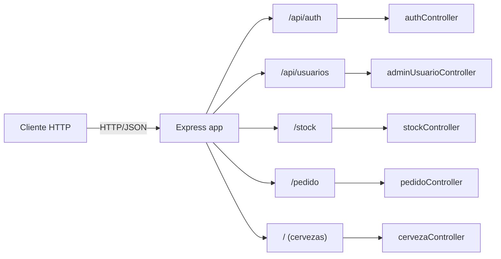
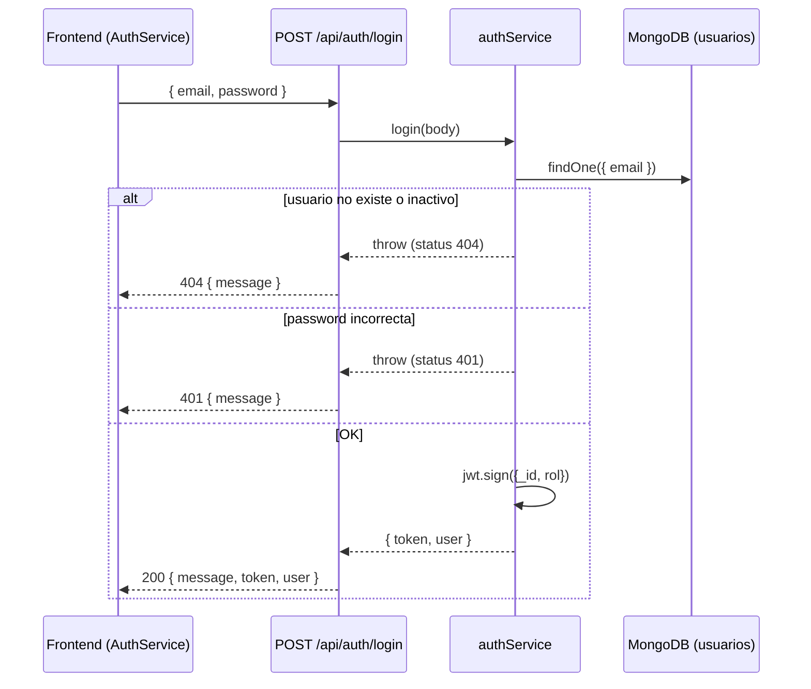
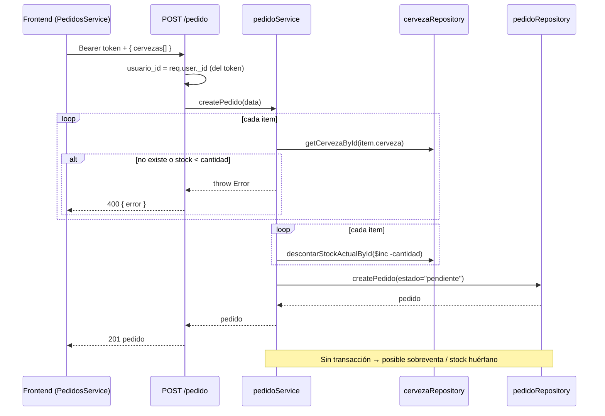

# API REST — Referencia de Endpoints

Referencia completa de la API REST del backend (`backEnd/`). **Todos los contratos descriptos aquí están derivados directamente del código** (`routes/`, `controllers/`, `services/`, `repository/`). No se documentan endpoints ni campos que no existan en el código.

- **Base URL (dev):** `http://localhost:3000`
- **Formato:** JSON (request y response). El backend registra `express.json()` globalmente ([index.js:15](../../backEnd/index.js#L15)).
- **CORS:** restringido a orígenes `localhost` (`app.use(cors({ origin: [/^http:\/\/localhost:\d+$/] }))`, [index.js:15](../../backEnd/index.js#L15)). Antes estaba abierto a todos los orígenes.
- **Autenticación:** el login emite un JWT (`{ _id, rol }`, `expiresIn: '1h'`) y el backend **lo exige en TODAS las rutas** mediante el header `Authorization: Bearer <token>`, **salvo** `POST /api/auth/register` y `POST /api/auth/login`. La verificación la hacen los middlewares `verifyToken` + `requireRole` ([middlewares/auth.js](../../backEnd/middlewares/auth.js)): `verifyToken` valida el token y deja `{ _id, rol }` en `req.user`; `requireRole(...)` restringe por rol. El secret se lee de `process.env.JWT_SECRET` con fallback `"TpCervezas"`. Ver [seguridad](../security/README.md).

---

## 1. Mapa de routers

El montaje de routers se hace en [index.js:19-27](../../backEnd/index.js#L19-L27):

| Prefijo | Router | Archivo | Acceso real backend |
|---|---|---|---|
| `/api/auth` | auth | [authRoutes.js](../../backEnd/routes/authRoutes.js) | público (`register` y `login`, sin token) |
| `/api/usuarios` | adminUsuario | [adminUsuarioRoutes.js](../../backEnd/routes/adminUsuarioRoutes.js) | `verifyToken` + `requireRole('admin')` (router-level) |
| `/stock` | stock | [stockRoutes.js](../../backEnd/routes/stockRoutes.js) | `verifyToken` + `requireRole('admin','empleado')` (router-level) |
| `/pedido` | pedido | [pedidoRoutes.js](../../backEnd/routes/pedidoRoutes.js) | `verifyToken` (router-level) + `requireRole` por endpoint |
| `/` | cerveza | [cervezaRoutes.js](../../backEnd/routes/cervezaRoutes.js) | `verifyToken` (cualquier rol autenticado) |

> El backend **sí valida** autenticación y rol vía `verifyToken` + `requireRole` ([middlewares/auth.js](../../backEnd/middlewares/auth.js)). El rol indicado por endpoint es el que efectivamente exige el backend (además de aplicarse en los guards del frontend). Ver [BUSINESS_RULES §3](../business/BUSINESS_RULES.md#3-roles-y-permisos).



---

## 2. Convenciones de respuesta de error

No hay middleware central de errores; cada controller arma su propio `catch`. Los formatos **no son uniformes**:

| Controller | Forma del error |
|---|---|
| `authController` | `{ "message": "..." }` |
| `adminUsuarioController` | `{ "code": 500, "message": "..." }` o `{ "message": "..." }` |
| `cervezaController` / `stockController` | `{ "error": "..." }` |
| `pedidoController` | `{ "error": "..." }` |

### Errores transversales de autenticación/autorización

Estos códigos los emiten los middlewares ([middlewares/auth.js](../../backEnd/middlewares/auth.js)) **antes** de llegar al controller, en cualquier endpoint protegido (todos salvo `POST /api/auth/register` y `POST /api/auth/login`):

| Código | Cuándo | Body |
|---|---|---|
| `401` | header `Authorization` ausente o sin prefijo `Bearer ` | `{ "message": "Token no provisto" }` |
| `401` | token inválido o expirado | `{ "message": "Token inválido o expirado" }` |
| `403` | token válido pero el rol no tiene permiso (`requireRole`) | `{ "message": "No tenés permisos para realizar esta acción" }` |

---

## 3. Auth — `/api/auth`

### 3.1 `POST /api/auth/register`

Registra un usuario. Por defecto crea rol `cliente`; si el body trae `rol: "empleado"` se respeta (usado por el flujo "admin crea empleado" del frontend). Cualquier otro valor de `rol` se ignora y queda `cliente`.

**Origen:** [authController.register](../../backEnd/controllers/authController.js#L3) → [authService.register](../../backEnd/services/authService.js#L7)

**Request body**

| Campo | Tipo | Requerido | Notas |
|---|---|---|---|
| `nombre` | string | sí | |
| `email` | string | sí | único en la colección |
| `password` | string | sí | se hashea con bcrypt (10 rounds) |
| `rol` | string | no | sólo `"empleado"` tiene efecto; otro valor → `cliente` |

```json
{
  "nombre": "Ana",
  "email": "ana@mail.com",
  "password": "secreta123"
}
```

**Respuestas**

| Código | Cuándo | Body |
|---|---|---|
| `201` | creado | `{ "message": "Usuario creado", "user": { "_id", "email", "rol" } }` |
| `400` | email ya registrado | `{ "message": "El email ya está registrado" }` |
| `500` | error inesperado | `{ "message": "Error al registrar usuario" }` |

```json
// 201
{
  "message": "Usuario creado",
  "user": { "_id": "665...", "email": "ana@mail.com", "rol": "cliente" }
}
```

---

### 3.2 `POST /api/auth/login`

Valida credenciales y emite un JWT (`{ _id, rol }`, `expiresIn: '1h'`, firmado con `process.env.JWT_SECRET`).

**Origen:** [authController.login](../../backEnd/controllers/authController.js#L12) → [authService.login](../../backEnd/services/authService.js#L30)

**Request body**

| Campo | Tipo | Requerido |
|---|---|---|
| `email` | string | sí |
| `password` | string | sí |

```json
{ "email": "ana@mail.com", "password": "secreta123" }
```

**Respuestas**

| Código | Cuándo | Body |
|---|---|---|
| `200` | login OK | `{ "message": "Login exitoso", "token": "<jwt>", "user": { "_id", "email", "nombre", "rol", "activo" } }` |
| `404` | usuario inexistente o inactivo | `{ "message": "Usuario no encontrado" }` / `{ "message": "El usuario no esta activo." }` |
| `401` | password incorrecta | `{ "message": "Contraseña incorrecta" }` |
| `500` | error inesperado | `{ "message": "<mensaje>" }` |

> ✅ **Corregido.** El controller ahora propaga el status del error con `res.status(error.status || 500)` ([authController.js:17](../../backEnd/controllers/authController.js#L17)), igual que `register`. El `authService.login` lanza errores con `error.status = 404` (usuario no encontrado / inactivo) y `error.status = 401` (password incorrecta), y esos códigos llegan tal cual al cliente. Solo se devuelve `500` ante un error inesperado (sin `status`). _Antes el controller hacía `res.status(500)` fijo, por lo que todos los fallos de login se reportaban como `500`; eso ya no ocurre._

```json
// 200
{
  "message": "Login exitoso",
  "token": "eyJhbGciOiJIUzI1NiIsInR5cCI6IkpXVCJ9...",
  "user": { "_id": "665...", "email": "ana@mail.com", "nombre": "Ana", "rol": "cliente", "activo": true }
}
```



---

## 4. Usuarios (admin) — `/api/usuarios`

Rol requerido: **admin**. El router aplica `verifyToken` + `requireRole('admin')` a todas sus rutas (GET, POST, PATCH). Sin token → `401`; rol distinto de `admin` → `403`.

### 4.1 `GET /api/usuarios`

Lista todos los usuarios. **Devuelve el campo `password` (hash) de cada usuario** — `Usuario.find()` sin proyección.

**Origen:** [readUsersController](../../backEnd/controllers/adminUsuarioController.js#L18) → [getAllUsuariosService](../../backEnd/services/adminUsuarioService.js#L35) → `getAllUsuariosRepository`

| Código | Body |
|---|---|
| `200` | `[ { _id, nombre, email, password, rol, activo, createdAt, updatedAt, __v }, ... ]` |
| `500` | `{ "code": 500, "message": "Error al obtener los usuarios: ..." }` |

### 4.2 `POST /api/usuarios`

Crea un **empleado**. El service fuerza `rol: 'empleado'`; sólo se usan `nombre`, `email`, `password` del body.

**Origen:** [createEmpleadoController](../../backEnd/controllers/adminUsuarioController.js#L3) → [createEmpleadoService](../../backEnd/services/adminUsuarioService.js#L5)

**Request body**

| Campo | Tipo | Requerido |
|---|---|---|
| `nombre` | string | sí |
| `email` | string | sí (único) |
| `password` | string | sí (se hashea con bcrypt) |

**Respuestas**

| Código | Cuándo | Body |
|---|---|---|
| `200` | creado (status por defecto de `res.send`) | documento Usuario creado, **incluye `password` hash** |
| `409` | email ya registrado | `{ "message": "El email ya está registrado" }` |
| `500` | error | `{ "code": 500, "message": "Error al crear empleado...." }` |

> El service loguea la password en texto plano en consola antes de hashearla ([adminUsuarioService.js:7](../../backEnd/services/adminUsuarioService.js#L7)).

### 4.3 `PATCH /api/usuarios/:id`

Actualiza un usuario. Pensado para activar/desactivar (`activo`) o cambiar `rol`, pero **acepta cualquier campo del body** y lo pasa a `findByIdAndUpdate` (mass-assignment). Corre `runValidators: true`, así que `rol` queda restringido al enum.

**Origen:** [updateUsuarioByIdController](../../backEnd/controllers/adminUsuarioController.js#L30) → [updateUsuarioService](../../backEnd/services/adminUsuarioService.js#L46) → [updateUsuario repo](../../backEnd/repository/adminUsuarioRepository.js#L34)

**Path param:** `id` (ObjectId del usuario)

**Request body (ejemplos):** `{ "activo": false }` · `{ "rol": "empleado" }`

| Código | Cuándo | Body |
|---|---|---|
| `200` | actualizado | documento Usuario actualizado (`{ new: true }`) |
| `404` | id inexistente | `{ "message": "Usuario no encontrado con el ID: <id>" }` |
| `500` | error | `{ "message": "Error al actualizar el usuario." }` |

> ⚠️ Bug conocido: en el `catch` del service, `throw error("...")` invoca la variable `error` (un `Error`, no una función) → lanza `TypeError`; el controller lo convierte en `500`. Ver [BUSINESS_RULES](../business/BUSINESS_RULES.md) / [deuda técnica](../README.md#deuda-técnica).

---

## 5. Cervezas (catálogo) — `/`

Montado en la raíz. Sólo lectura. Lo consume el cliente para ver el catálogo. **Requiere token** (`verifyToken`): cualquier rol autenticado puede leer, pero sin `Authorization: Bearer <token>` válido devuelve `401`.

### 5.1 `GET /`

Lista todas las cervezas (incluye `activo: false`, sin paginación).

**Origen:** [cervezaController.getAllCervezas](../../backEnd/controllers/cervezaController.js#L3)

| Código | Body |
|---|---|
| `200` | `[ ICerveza, ... ]` |
| `500` | `{ "error": "..." }` |

### 5.2 `GET /:id`

Obtiene una cerveza por ID. **Atención:** al estar montado en `/`, esta ruta captura cualquier path de un solo segmento no tomado por `/stock`, `/pedido`, `/api/...`.

**Origen:** [cervezaController.getCervezaById](../../backEnd/controllers/cervezaController.js#L12)

| Código | Body |
|---|---|
| `200` | `ICerveza` |
| `404` | `{ "error": "Cerveza no encontrada" }` |
| `500` | `{ "error": "..." }` |

---

## 6. Stock de cervezas — `/stock`

Rol requerido: **admin / empleado**. El router aplica `verifyToken` + `requireRole('admin','empleado')` a todas sus rutas (POST, GET, GET/:id, DELETE, PATCH). Sin token → `401`; otro rol → `403`. CRUD completo de cervezas.

### 6.1 `POST /stock`

Crea una cerveza. Valida tipos en el controller.

**Origen:** [stockController.createCerveza](../../backEnd/controllers/stockController.js#L3)

**Request body**

| Campo | Tipo | Requerido | Default | Validación en controller |
|---|---|---|---|---|
| `nombre` | string | sí | — | requerido, string |
| `tipo` | string | sí | — | requerido, string |
| `stock_actual` | number | no | `0` | si viene (truthy), debe ser number |
| `stock_minimo` | number | no | `0` | si viene (truthy), debe ser number |
| `activo` | boolean | no | `true` | si viene (truthy), debe ser boolean |

> ⚠️ Bug de falsy: las validaciones usan `if (stock_actual && ...)`, por lo que `0` y `false` "pasan" sin validar el tipo ([stockController.js:13-19](../../backEnd/controllers/stockController.js#L13-L19)).

```json
{ "nombre": "IPA", "tipo": "Ale", "stock_actual": 100, "stock_minimo": 10, "activo": true }
```

| Código | Cuándo | Body |
|---|---|---|
| `201` | creada | documento `ICerveza` |
| `400` | falta `nombre`/`tipo` o tipo inválido | `{ "error": "<detalle>" }` |
| `400` | error de Mongoose | `{ "error": "<message>" }` |

### 6.2 `GET /stock`

Lista todas las cervezas. **Origen:** [stockController.getAllCervezas](../../backEnd/controllers/stockController.js#L31). Igual que `GET /`.

| Código | Body |
|---|---|
| `200` | `[ ICerveza, ... ]` |
| `500` | `{ "error": "..." }` |

### 6.3 `GET /stock/:id`

| Código | Body |
|---|---|
| `200` | `ICerveza` |
| `404` | `{ "error": "Cerveza no encontrada" }` |
| `500` | `{ "error": "..." }` |

### 6.4 `DELETE /stock/:id`

Borrado físico (`findByIdAndDelete`). No verifica pedidos que la referencien ni restituye nada.

| Código | Body |
|---|---|
| `200` | `{ "message": "Cerveza eliminada correctamente" }` |
| `404` | `{ "error": "Cerveza no encontrada" }` |
| `500` | `{ "error": "..." }` |

### 6.5 `PATCH /stock/:id`

Actualiza sólo los campos presentes en el body. El repositorio rechaza stock negativo.

**Origen:** [stockController.updateCerveza](../../backEnd/controllers/stockController.js#L64) → [updateCerveza repo](../../backEnd/repository/cervezaRepository.js#L20)

**Request body (cualquier subconjunto):** `nombre`, `tipo`, `stock_actual`, `stock_minimo`, `activo`.

| Código | Cuándo | Body |
|---|---|---|
| `200` | actualizada | `ICerveza` actualizada |
| `400` | falta `:id` | `{ "error": "ID de cerveza requerido" }` |
| `404` | id inexistente | `{ "error": "Cerveza no encontrada" }` |
| `500` | `stock_actual < 0` o `stock_minimo < 0`, u otro error | `{ "error": "El stock_actual no puede ser negativo" }` |

---

## 7. Pedidos — `/pedido`

Todas las rutas requieren token (`verifyToken` a nivel de router). Rol requerido por endpoint (`requireRole`): `POST /pedido` → **cliente**; `GET /pedido`, `PATCH /pedido/:id`, `DELETE /pedido/:id` → **admin/empleado**; `GET /pedido/:id` y `GET /pedido/usuario/:usuarioId` → **cualquier rol autenticado** (solo `verifyToken`). Sin token → `401`; rol sin permiso → `403`.

### 7.1 `POST /pedido`

Crea un pedido en estado `pendiente` y **descuenta stock** de cada cerveza. Lógica de negocio en [pedidoService.createPedido](../../backEnd/services/pedidoService.js#L4).

**Origen:** [pedidoController.createPedido](../../backEnd/controllers/pedidoController.js#L3)

**Request body**

| Campo | Tipo | Requerido | Notas |
|---|---|---|---|
| `usuario_id` | — | — | **NO se envía en el body**; se deriva del token (`req.user._id`) en el controller ([pedidoController.js:7](../../backEnd/controllers/pedidoController.js#L7)) |
| `cervezas` | array | sí | no vacío |
| `cervezas[].cerveza` | ObjectId (string) | sí | debe existir |
| `cervezas[].cantidad` | number | sí | debe ser **entero** y **> 0** (si no, `400`) |

```json
{
  "cervezas": [
    { "cerveza": "665bbb...", "cantidad": 3 },
    { "cerveza": "665ccc...", "cantidad": 1 }
  ]
}
```

**Lógica:** valida que cada cerveza exista y que `stock_actual >= cantidad`; luego descuenta (`$inc: -cantidad`) y crea el pedido. **No es transaccional** (ver riesgos).

| Código | Cuándo | Body |
|---|---|---|
| `201` | creado | documento `Pedido` (estado `pendiente`) |
| `400` | `cervezas` ausente, no-array o array vacío | `{ "error": "Faltan datos requeridos" }` |
| `400` | ítem sin `cerveza`, o `cantidad` no entera / `<= 0` | `{ "error": "Cada cerveza debe tener id y una cantidad entera mayor a 0" }` |
| `400` | cerveza inexistente | `{ "error": "Cerveza con ID <id> no encontrada" }` |
| `400` | stock insuficiente | `{ "error": "Stock insuficiente para <nombre>" }` |

> El `usuario_id` del pedido se toma de `req.user._id` (del token), no del body — evita crear pedidos a nombre de otro usuario.



### 7.2 `GET /pedido`

Lista todos los pedidos (admin/empleado). `Pedido.find().lean()`, **sin `populate`** → `cervezas[].cerveza`, `usuario_id` y `aprobado_por` son sólo ObjectIds.

| Código | Body |
|---|---|
| `200` | `[ Pedido, ... ]` |
| `400` | `{ "error": "..." }` |

### 7.3 `GET /pedido/:id`

| Código | Body |
|---|---|
| `200` | `Pedido` |
| `400` | falta id | `{ "error": "ID de pedido requerido" }` |
| `404` | no encontrado | `{ "error": "Pedido no encontrado" }` |

### 7.4 `GET /pedido/usuario/:usuarioId`

Pedidos de un usuario. **Origen:** [getPedidosByUsuario](../../backEnd/controllers/pedidoController.js#L53).

| Código | Body |
|---|---|
| `200` | `[ Pedido, ... ]` (puede ser `[]`) |
| `400` | `{ "error": "..." }` |

### 7.5 `DELETE /pedido/:id`

Borrado físico. **No restituye stock.**

| Código | Body |
|---|---|
| `200` | `{ "message": "Pedido eliminado correctamente" }` |
| `404` | `{ "error": "Pedido no encontrado" }` |
| `400` | `{ "error": "..." }` |

### 7.6 `PATCH /pedido/:id`

Aprobar / rechazar (o cambiar `aprobado_por`). Sólo se aplican los campos `aprobado_por` y `estado`. Si `estado === 'aprobado'`, se setea `fecha_aprobacion = new Date()`. **No restituye stock al rechazar.**

**Origen:** [pedidoController.updatePedido](../../backEnd/controllers/pedidoController.js#L81) → [updatePedido repo](../../backEnd/repository/pedidoRepository.js#L26)

**Request body**

| Campo | Tipo | Notas |
|---|---|---|
| `estado` | string | debe estar en `['pendiente','aprobado','rechazado']` |
| `aprobado_por` | ObjectId (string) | id del empleado/admin que resuelve |

```json
{ "estado": "aprobado", "aprobado_por": "665ddd..." }
```

| Código | Cuándo | Body |
|---|---|---|
| `200` | actualizado | `Pedido` actualizado |
| `404` | id inexistente | `{ "error": "Pedido no encontrado" }` |
| `400` | `estado` fuera del enum, u otro error | `{ "error": "Estado no válido" }` |

---

## 8. Tabla resumen de endpoints

| Método | Ruta | Acción | Rol requerido (backend) | Éxito |
|---|---|---|---|---|
| POST | `/api/auth/register` | Registrar usuario/cliente | público (sin token) | 201 |
| POST | `/api/auth/login` | Login + JWT | público (sin token) | 200 |
| GET | `/api/usuarios` | Listar usuarios | admin | 200 |
| POST | `/api/usuarios` | Crear empleado | admin | 200 |
| PATCH | `/api/usuarios/:id` | Activar/desactivar / cambiar rol | admin | 200 |
| GET | `/` | Listar cervezas (catálogo) | cualquier rol autenticado | 200 |
| GET | `/:id` | Cerveza por ID | cualquier rol autenticado | 200 |
| POST | `/stock` | Crear cerveza | admin/empleado | 201 |
| GET | `/stock` | Listar cervezas | admin/empleado | 200 |
| GET | `/stock/:id` | Cerveza por ID | admin/empleado | 200 |
| DELETE | `/stock/:id` | Eliminar cerveza | admin/empleado | 200 |
| PATCH | `/stock/:id` | Modificar cerveza | admin/empleado | 200 |
| POST | `/pedido` | Crear pedido (descuenta stock) | cliente | 201 |
| GET | `/pedido` | Listar todos los pedidos | admin/empleado | 200 |
| GET | `/pedido/:id` | Pedido por ID | cualquier rol autenticado | 200 |
| GET | `/pedido/usuario/:usuarioId` | Pedidos de un usuario | cualquier rol autenticado | 200 |
| DELETE | `/pedido/:id` | Eliminar pedido | admin/empleado | 200 |
| PATCH | `/pedido/:id` | Aprobar/rechazar pedido | admin/empleado | 200 |

> Todos los endpoints salvo `POST /api/auth/register` y `POST /api/auth/login` requieren `Authorization: Bearer <token>`. Token ausente/inválido → `401`; rol sin permiso → `403`.

---

## 9. Consumo desde el frontend

Mapa servicio Angular → endpoint:

| Servicio (`frontEnd/src/services/`) | Cliente HTTP | Endpoints que consume |
|---|---|---|
| [AuthService](../../frontEnd/src/services/authService.ts) | **Axios** | `POST /api/auth/register`, `POST /api/auth/login` |
| [UsuarioService](../../frontEnd/src/services/UsuarioService.ts) | HttpClient | `GET /api/usuarios`, `PATCH /api/usuarios/:id` |
| [CervezaService](../../frontEnd/src/services/cerveza.service.ts) | HttpClient | `GET /`, `GET /:id`, `POST /stock`, `PATCH /stock/:id`, `DELETE /stock/:id` |
| [PedidosService](../../frontEnd/src/services/pedidos.service.ts) | HttpClient | `GET /pedido`, `GET /pedido/:id`, `GET /pedido/usuario/:id`, `POST /pedido`, `PATCH /pedido/:id`, `DELETE /pedido/:id` |

> El frontend **React** (`frontReact/`) **sí envía** el JWT: un interceptor de Axios adjunta `Authorization: Bearer <token>` a toda request y, ante un `401`, limpia la sesión y redirige al login ([frontReact/src/services/http.ts](../../frontReact/src/services/http.ts)). El frontend **Angular** viejo (`frontEnd/`) **no** envía el token, por lo que quedó roto a propósito contra el backend actual. Ver [seguridad](../security/README.md).

---

_Documentación derivada del código. Última verificación de contratos contra `backEnd/` el 2026-06-17._
