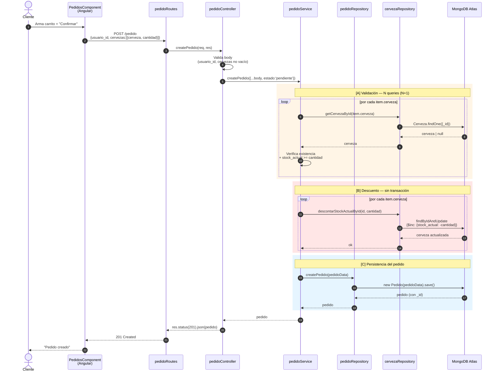
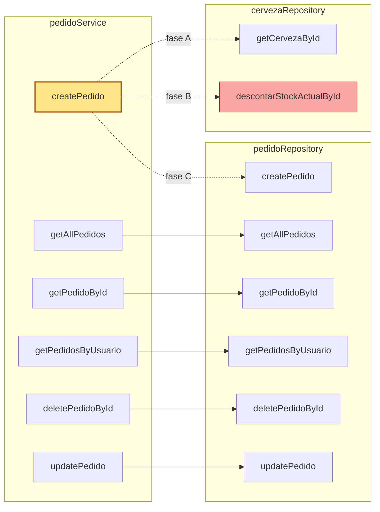
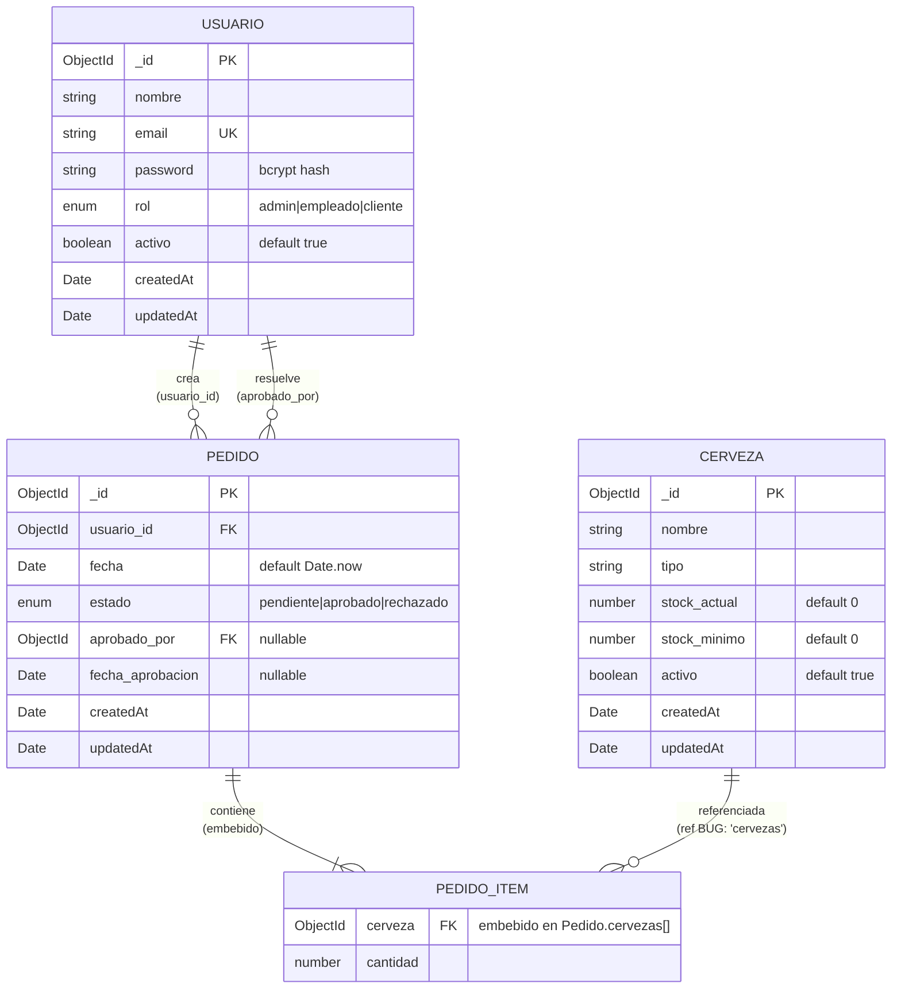
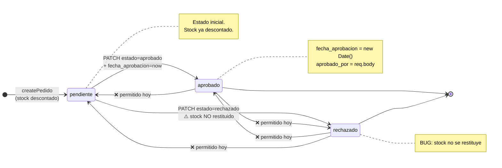
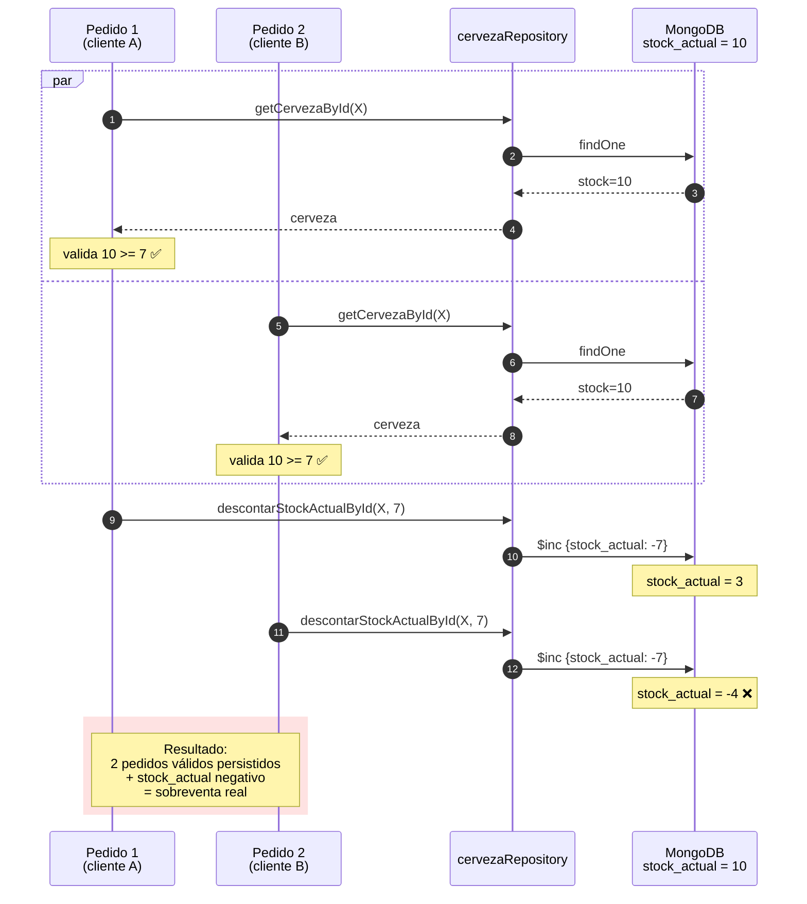
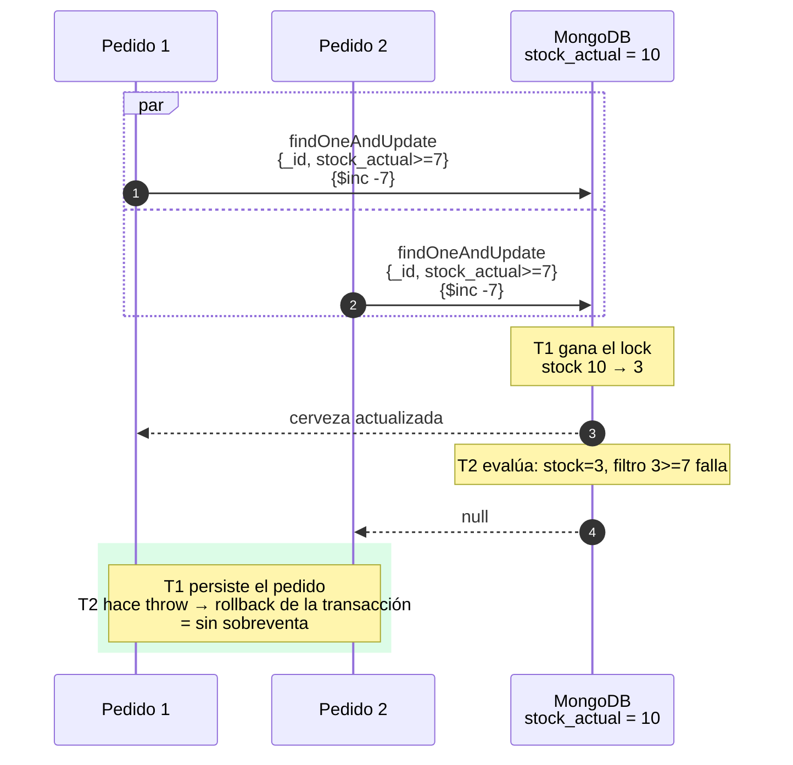

# Diagramas — Módulo `pedidoService.js`

Complemento visual del análisis técnico en [MODULE_PEDIDO_SERVICE.md](MODULE_PEDIDO_SERVICE.md). Cinco diagramas Mermaid:

1. [Flujo de datos completo (`createPedido`)](#1-flujo-de-datos--createpedido-end-to-end)
2. [Relación entre componentes (arquitectura por capas)](#2-relación-entre-componentes)
3. [Interacción entre servicios y repositorios](#3-interacción-entre-servicios)
4. [Conexión con la base de datos (modelo de datos)](#4-conexión-con-la-base-de-datos)
5. [Máquina de estados del pedido](#5-máquina-de-estados-del-pedido)
6. [Bonus — Race condition (sobreventa de stock)](#6-bonus--race-condition-en-createpedido)

---

## 1. Flujo de datos — `createPedido` end-to-end

Recorrido completo de un `POST /pedido` desde el frontend hasta MongoDB y vuelta. Las tres fases del service están marcadas como **[A]**, **[B]**, **[C]** (ver [MODULE_PEDIDO_SERVICE.md §3.1](MODULE_PEDIDO_SERVICE.md#31-createpedido--la-función-con-lógica-real)).



> ⚠️ Entre **[A] y [B]** no hay candado: si dos clientes llaman simultáneamente, ambos pueden pasar la validación con el mismo `stock_actual` y descontar de más. Ver [§6](#6-bonus--race-condition-en-createpedido).

---

## 2. Relación entre componentes

Vista por capas (route → controller → service → repository → model → DB) y las dependencias **externas** del módulo (frontend, otros services).

```mermaid
graph TB
    subgraph Front["Frontend Angular"]
        PC[PedidosComponent]
        PSFE[PedidosService<br/>HttpClient]
        APedidos[AdministrarPedidos<br/>Component]
    end

    subgraph Routes["Backend · Routes"]
        PR[pedidoRoutes.js]
    end

    subgraph Controllers["Backend · Controllers"]
        PCtrl[pedidoController.js]
    end

    subgraph Services["Backend · Services"]
        PSv[pedidoService.js]
    end

    subgraph Repositories["Backend · Repositories"]
        PRep[pedidoRepository.js]
        CRep[cervezaRepository.js]
    end

    subgraph Models["Backend · Models (Mongoose)"]
        PM[Pedido]
        CM[Cerveza]
        UM[Usuario]
    end

    DB[(MongoDB Atlas)]

    PC -->|"createPedido(...)"| PSFE
    APedidos -->|"updatePedido / delete"| PSFE
    PSFE -->|HTTP JSON| PR
    PR --> PCtrl
    PCtrl --> PSv
    PSv -->|"CRUD Pedido"| PRep
    PSv -->|"validar + descontar stock"| CRep
    PRep --> PM
    CRep --> CM
    PM -.ref usuario_id.-> UM
    PM -.ref cervezas.cerveza<br/>BUG cervezas.-> CM
    PM --> DB
    CM --> DB
    UM --> DB

    style PSv fill:#fde68a,stroke:#b45309,stroke-width:2px
    style CRep fill:#fed7aa,stroke:#9a3412
    style PRep fill:#fed7aa,stroke:#9a3412
```

> Resaltado en amarillo el target del análisis. En naranja, los dos repositorios que el service coordina simultáneamente (única ocurrencia en todo el backend).

---

## 3. Interacción entre servicios

Detalle del **fan-out** de llamadas que hace `pedidoService` hacia los dos repositorios. Útil para ver dónde se concentra la complejidad.



Observaciones:
- **5 de 6 funciones son pass-through** al repositorio. Solo `createPedido` tiene lógica real.
- `createPedido` es la **única** que cruza la frontera del agregado `Pedido` para tocar `Cerveza`.
- `descontarStockActualById` (rojo) es el punto donde se materializa el riesgo R1: ningún filtro condicional, solo `$inc`.

---

## 4. Conexión con la base de datos

Modelo de datos en MongoDB. Las relaciones son **por referencia** (no hay FK reales en Mongo — son `ObjectId` que apuntan a `_id` de otra colección).



Notas sobre el modelo:
- **`PEDIDO_ITEM` no es una colección**: vive embebido en `Pedido.cervezas[]`. Aquí está separado solo para visualizar la relación.
- **`ref: 'cervezas'` apunta a un modelo que no existe** ([Pedido.js:11](../../backEnd/models/Pedido.js#L11)). El modelo está registrado como `'Cerveza'`. Cualquier `.populate('cervezas.cerveza')` va a fallar silenciosamente.
- **No hay índices declarados** en `Pedido` (más allá del `_id`). Búsquedas por `usuario_id` y `estado` hacen full collection scan.

---

## 5. Máquina de estados del pedido

Transiciones permitidas (en azul) y transiciones que **no están bloqueadas pero deberían estarlo** (en rojo).



El enum del schema (`['pendiente', 'aprobado', 'rechazado']`) restringe los **valores** pero no las **transiciones**. Hoy un `PATCH /pedido/:id {estado:'pendiente'}` sobre un pedido `rechazado` es aceptado sin validar.

---

## 6. Bonus — Race condition en `createPedido`

Visualización del riesgo **R1** (sobreventa de stock). Escenario: `stock_actual = 10`, dos clientes piden 7 unidades simultáneamente.



**Fix propuesto** (ver [MODULE_PEDIDO_SERVICE.md §7](MODULE_PEDIDO_SERVICE.md#prioridad-1--correctitud)): reemplazar las dos fases por un `findOneAndUpdate` con filtro condicional dentro de una transacción Mongo. Esto convierte "valida + descuenta" en una única operación atómica: si el filtro `stock_actual >= cantidad` no matchea, el descuento no ocurre y la transacción falla.



---

## Cómo renderizar estos diagramas

- **GitHub**: renderiza Mermaid nativamente en archivos `.md` desde 2022 — solo abrir el archivo en el repo.
- **VSCode**: con la extensión [Markdown Preview Mermaid Support](https://marketplace.visualstudio.com/items?itemName=bierner.markdown-mermaid) en el preview (`Ctrl+Shift+V`).
- **Standalone**: copiar el bloque y pegar en [mermaid.live](https://mermaid.live).
