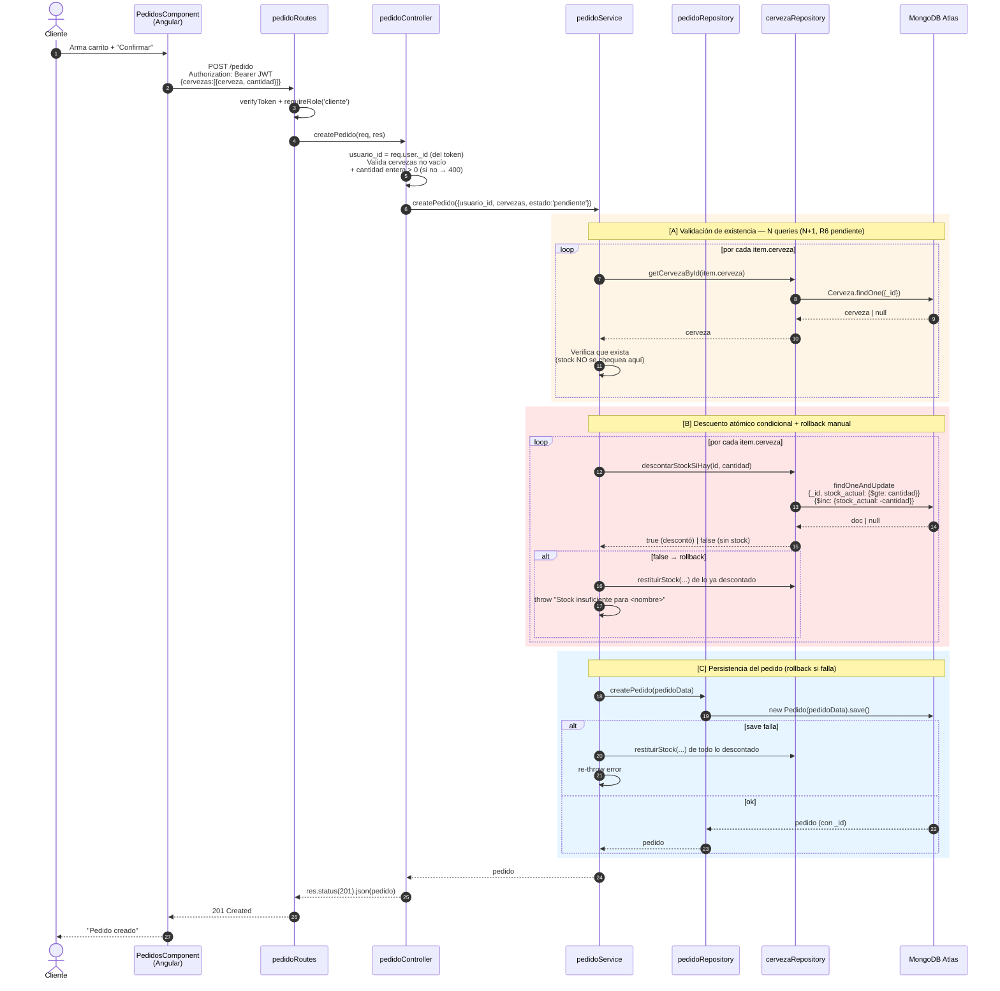
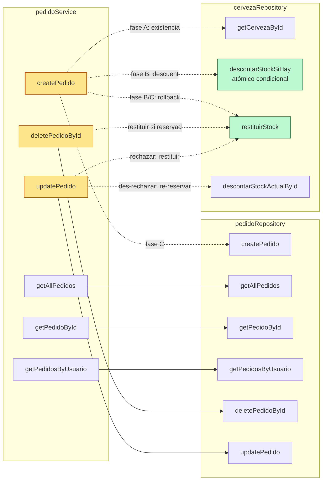
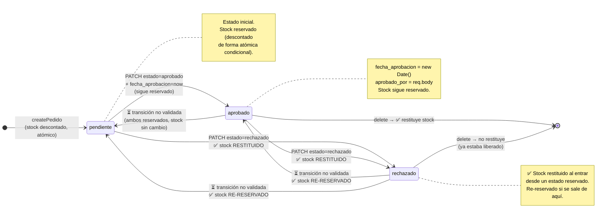
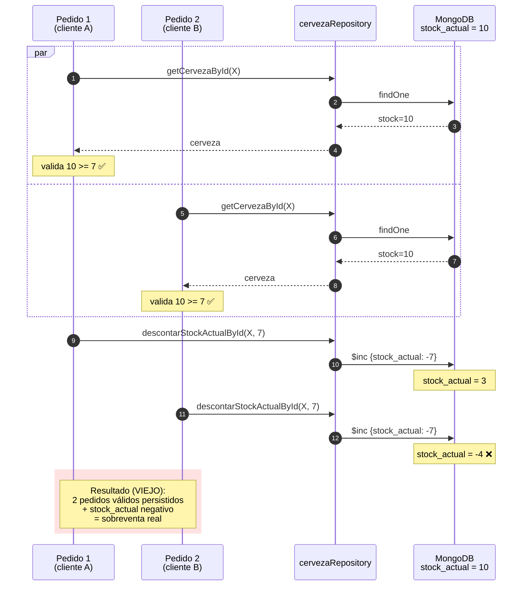
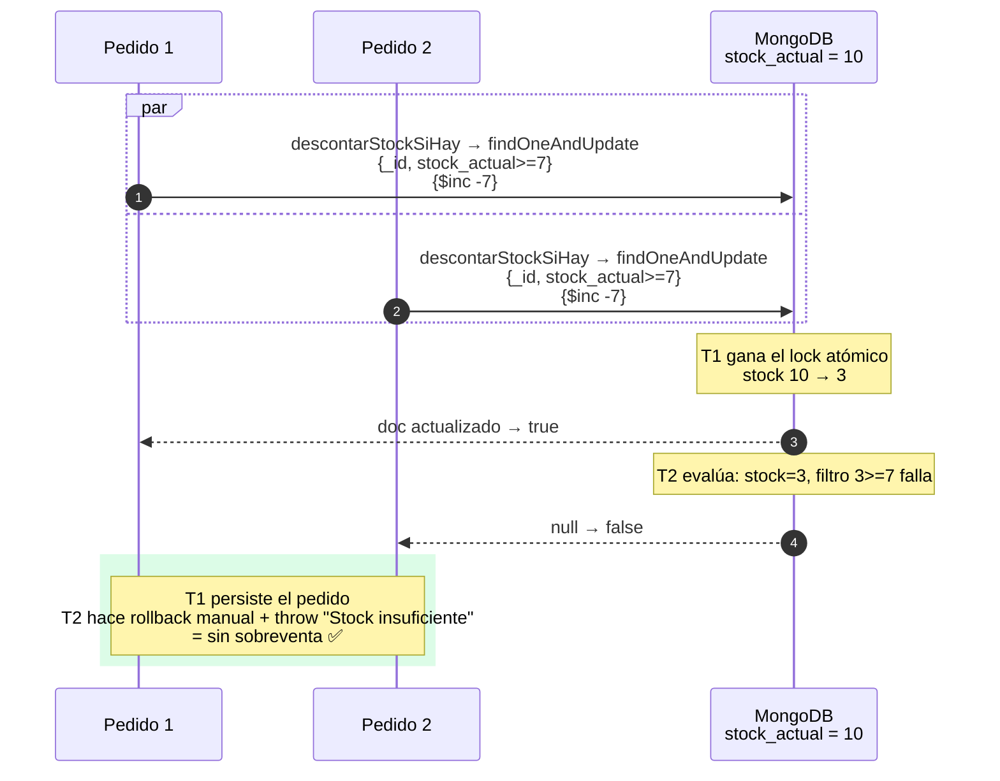

# Diagramas — Módulo `pedidoService.js`

Complemento visual del análisis técnico en [MODULE_PEDIDO_SERVICE.md](MODULE_PEDIDO_SERVICE.md). Cinco diagramas Mermaid:

> **Última actualización:** 2026-06-17 (refleja el commit `5f8172e` en `main`).

1. [Flujo de datos completo (`createPedido`)](#1-flujo-de-datos--createpedido-end-to-end)
2. [Relación entre componentes (arquitectura por capas)](#2-relación-entre-componentes)
3. [Interacción entre servicios y repositorios](#3-interacción-entre-servicios)
4. [Conexión con la base de datos (modelo de datos)](#4-conexión-con-la-base-de-datos)
5. [Máquina de estados del pedido](#5-máquina-de-estados-del-pedido)
6. [Bonus — Race condition (sobreventa de stock)](#6-bonus--race-condition-en-createpedido)

---

## 1. Flujo de datos — `createPedido` end-to-end

Recorrido completo de un `POST /pedido` desde el frontend hasta MongoDB y vuelta. Las tres fases del service están marcadas como **[A]**, **[B]**, **[C]** (ver [MODULE_PEDIDO_SERVICE.md §3.1](MODULE_PEDIDO_SERVICE.md#31-createpedido--la-función-con-lógica-real)).



> ✅ **Resuelto (commit `5f8172e`):** el descuento en **[B]** es atómico y condicional (`findOneAndUpdate` con filtro `stock_actual >= cantidad`), así que dos clientes concurrentes ya no pueden sobrevender — el segundo recibe `false` y se hace rollback. Ver [§6](#6-bonus--race-condition-en-createpedido).
> ⚠️ Aún sin transacción multi-documento real: para pedidos multi-ítem el rollback es manual (best-effort).

---

## 2. Relación entre componentes

Vista por capas (route → controller → service → repository → model → DB) y las dependencias **externas** del módulo (frontend, otros services).

```mermaid
graph TB
    subgraph Front["Frontend Angular"]
        PC[PedidosComponent]
        PSFE[PedidosService<br/>HttpClient]
        APedidos[AdministrarPedidos<br/>Component]
    end

    subgraph Routes["Backend · Routes"]
        PR[pedidoRoutes.js]
    end

    subgraph Controllers["Backend · Controllers"]
        PCtrl[pedidoController.js]
    end

    subgraph Services["Backend · Services"]
        PSv[pedidoService.js]
    end

    subgraph Repositories["Backend · Repositories"]
        PRep[pedidoRepository.js]
        CRep[cervezaRepository.js]
    end

    subgraph Models["Backend · Models (Mongoose)"]
        PM[Pedido]
        CM[Cerveza]
        UM[Usuario]
    end

    DB[(MongoDB Atlas)]

    PC -->|"createPedido(...)"| PSFE
    APedidos -->|"updatePedido / delete"| PSFE
    PSFE -->|"HTTP JSON + Bearer JWT"| PR
    PR -->|"verifyToken + requireRole"| PCtrl
    PCtrl --> PSv
    PSv -->|"CRUD Pedido"| PRep
    PSv -->|"existencia + descontarStockSiHay<br/>restituirStock"| CRep
    PRep --> PM
    CRep --> CM
    PM -.ref usuario_id.-> UM
    PM -.ref cervezas.cerveza<br/>'Cerveza' ✅ corregido.-> CM
    PM --> DB
    CM --> DB
    UM --> DB

    style PSv fill:#fde68a,stroke:#b45309,stroke-width:2px
    style CRep fill:#fed7aa,stroke:#9a3412
    style PRep fill:#fed7aa,stroke:#9a3412
```

> Resaltado en amarillo el target del análisis. En naranja, los dos repositorios que el service coordina simultáneamente (única ocurrencia en todo el backend).

---

## 3. Interacción entre servicios

Detalle del **fan-out** de llamadas que hace `pedidoService` hacia los dos repositorios. Útil para ver dónde se concentra la complejidad.



Observaciones:
- **3 de 6 funciones son pass-through** (`getAllPedidos`, `getPedidoById`, `getPedidosByUsuario`). `createPedido`, `deletePedidoById` y `updatePedido` (amarillo) tienen lógica de coordinación de stock.
- Las tres funciones con lógica cruzan la frontera del agregado `Pedido` para tocar `Cerveza`.
- ✅ `descontarStockSiHay` (verde) reemplaza al `$inc` incondicional en la creación: el filtro `stock_actual >= cantidad` cierra R1. `restituirStock` (verde) implementa el rollback y la liberación de stock (R2/R3).
- ⚠️ `descontarStockActualById` (incondicional) **sigue usándose** en la **re-reserva** de `updatePedido` (des-rechazar): podría dejar stock negativo si ya no hay existencias.

---

## 4. Conexión con la base de datos

Modelo de datos en MongoDB. Las relaciones son **por referencia** (no hay FK reales en Mongo — son `ObjectId` que apuntan a `_id` de otra colección).


Notas sobre el modelo:
- **`PEDIDO_ITEM` no es una colección**: vive embebido en `Pedido.cervezas[]`. Aquí está separado solo para visualizar la relación.
- ✅ **`ref: 'Cerveza'` corregido (commit `5f8172e`)** ([Pedido.js](../../backEnd/models/Pedido.js)). Coincide con el modelo registrado, así que un `.populate('cervezas.cerveza')` ya resolvería. ⏳ Pendiente: las queries de pedido **todavía no invocan `populate`**, así que en la práctica siguen devolviendo `ObjectId` sueltos.
- **No hay índices declarados** en `Pedido` (más allá del `_id`). Búsquedas por `usuario_id` y `estado` hacen full collection scan.

---

## 5. Máquina de estados del pedido

Las transiciones **siguen sin validarse** (⏳ no hay máquina de estados explícita), pero su **efecto sobre el stock ya se maneja** en `updatePedido`/`deletePedidoById` (commit `5f8172e`). Estados `pendiente`/`aprobado` mantienen stock **reservado**; `rechazado` lo **libera**.



El enum del schema (`['pendiente', 'aprobado', 'rechazado']`) restringe los **valores** pero ⏳ **no las transiciones**: un `PATCH /pedido/:id {estado:'pendiente'}` sobre un pedido `rechazado` sigue aceptándose sin validar. La diferencia respecto al estado anterior es que ahora ese cambio **re-reserva el stock** (vía `descontarStockActualById`), en vez de dejar el inventario inconsistente.

> ⚠️ Matiz: la re-reserva al des-rechazar usa el descuento **incondicional** (`descontarStockActualById`), no el condicional, por lo que podría llevar `stock_actual` a negativo si ya no hay existencias.

---

## 6. Bonus — Race condition en `createPedido` (✅ mitigada en commit `5f8172e`)

El riesgo **R1** (sobreventa de stock) **ya está mitigado**. Lo que antes figuraba como "fix propuesto" es ahora **lo implementado**: el descuento se hace con un `findOneAndUpdate` condicional (`descontarStockSiHay`), una sola operación atómica por documento. La transacción Mongo multi-documento sigue pendiente, pero para el caso de concurrencia sobre una misma cerveza el descuento atómico ya es suficiente.

### 6.1 Escenario histórico (comportamiento VIEJO, ya no ocurre)

Antes del fix, con `stock_actual = 10` y dos clientes pidiendo 7 simultáneamente la validación (lectura) y el descuento (`$inc` incondicional) eran pasos separados, lo que permitía la sobreventa:



### 6.2 Comportamiento ACTUAL (implementado, commit `5f8172e`)

El descuento usa `descontarStockSiHay` → `findOneAndUpdate({_id, stock_actual: {$gte: cantidad}}, {$inc: {stock_actual: -cantidad}})`. "Valida + descuenta" es una única operación atómica: si el filtro `stock_actual >= cantidad` no matchea, no hay descuento y la función devuelve `false`, lo que dispara el rollback manual y el `throw`.



> ⚠️ Pendiente (ver [MODULE_PEDIDO_SERVICE.md §7](MODULE_PEDIDO_SERVICE.md#prioridad-1--correctitud)): esto **no es** una transacción multi-documento. Para pedidos con varios ítems, si un ítem posterior falla, el rollback de los anteriores es manual (best-effort). Envolver todo en `session.withTransaction` daría atomicidad total.

---

## Cómo renderizar estos diagramas

- **GitHub**: renderiza Mermaid nativamente en archivos `.md` desde 2022 — solo abrir el archivo en el repo.
- **VSCode**: con la extensión [Markdown Preview Mermaid Support](https://marketplace.visualstudio.com/items?itemName=bierner.markdown-mermaid) en el preview (`Ctrl+Shift+V`).
- **Standalone**: copiar el bloque y pegar en [mermaid.live](https://mermaid.live).
