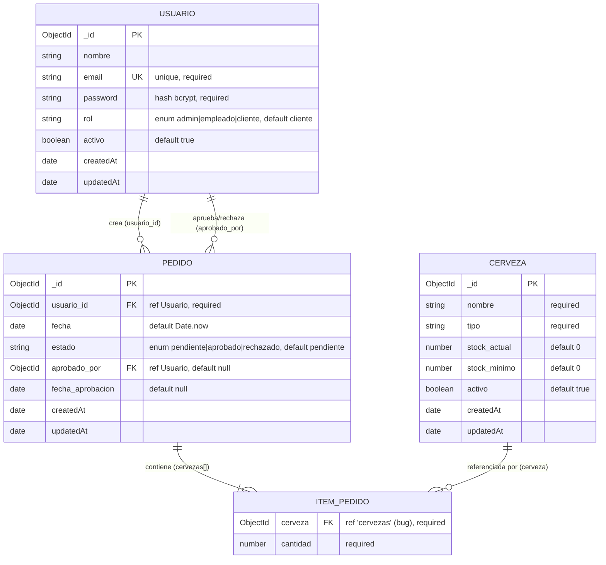

# Modelo de Datos

Documentación de la base de datos del proyecto: motor, colecciones, esquemas, relaciones, diagrama entidad-relación e índices. **Derivada de los schemas Mongoose** en [backEnd/models/](../../backEnd/models/).

---

## 1. Contexto

- **Motor:** MongoDB Atlas (cluster `cluster0.zbfn2s4`, URI en [config.js](../../backEnd/database/config.js)).
- **ODM:** Mongoose 8.
- **Conexión:** [connection.js](../../backEnd/database/connection.js) (`mongoose.connect(uri_db)`; si falla, `process.exit(1)`).
- **Colecciones:** `usuarios`, `cervezas`, `pedidos` (nombres pluralizados automáticamente por Mongoose a partir de los modelos `Usuario`, `Cerveza`, `Pedido`).
- **Timestamps:** las tres colecciones tienen `{ timestamps: true }` → campos `createdAt` y `updatedAt` automáticos.

---

## 2. Diagrama entidad-relación (ERD)

> `ITEM_PEDIDO` no es una colección propia: es el **subdocumento embebido** del array `cervezas[]` dentro de cada documento `Pedido` ([Pedido.js:9-14](../../backEnd/models/Pedido.js#L9-L14)).

---

## 3. Colecciones

### 3.1 `usuarios` — [Usuario.js](../../backEnd/models/Usuario.js)

| Campo | Tipo | Requerido | Default | Restricciones |
|---|---|---|---|---|
| `_id` | ObjectId | auto | auto | PK |
| `nombre` | String | sí | — | |
| `email` | String | sí | — | **único** (índice unique) |
| `password` | String | sí | — | hash bcrypt (10 rounds) |
| `rol` | String | sí | `"cliente"` | enum `admin` \| `empleado` \| `cliente` |
| `activo` | Boolean | no | `true` | si `false`, login rechazado |
| `createdAt` / `updatedAt` | Date | auto | auto | timestamps |

### 3.2 `cervezas` — [Cerveza.js](../../backEnd/models/Cerveza.js)

| Campo | Tipo | Requerido | Default | Restricciones |
|---|---|---|---|---|
| `_id` | ObjectId | auto | auto | PK |
| `nombre` | String | sí | — | |
| `tipo` | String | sí | — | string libre (sin enum) |
| `stock_actual` | Number | no | `0` | no negativo (validado en `updateCerveza`) |
| `stock_minimo` | Number | no | `0` | no negativo (validado en `updateCerveza`) |
| `activo` | Boolean | no | `true` | no filtra queries hoy |
| `createdAt` / `updatedAt` | Date | auto | auto | timestamps |

### 3.3 `pedidos` — [Pedido.js](../../backEnd/models/Pedido.js)

| Campo | Tipo | Requerido | Default | Restricciones |
|---|---|---|---|---|
| `_id` | ObjectId | auto | auto | PK |
| `usuario_id` | ObjectId | sí | — | FK → `Usuario` |
| `fecha` | Date | no | `Date.now` | |
| `estado` | String | no | `"pendiente"` | enum `pendiente` \| `aprobado` \| `rechazado` |
| `aprobado_por` | ObjectId | no | `null` | FK → `Usuario` |
| `fecha_aprobacion` | Date | no | `null` | se setea sólo al aprobar |
| `cervezas` | Array<subdoc> | sí | — | al menos requerido por validación de controller |
| `cervezas[].cerveza` | ObjectId | sí | — | FK → cerveza (`ref: 'cervezas'`, **bug**) |
| `cervezas[].cantidad` | Number | sí | — | |
| `createdAt` / `updatedAt` | Date | auto | auto | timestamps |

---

## 4. Relaciones

| Relación | Cardinalidad | Implementación |
|---|---|---|
| Usuario → Pedido (creador) | 1 : N | `Pedido.usuario_id` referencia `Usuario._id` |
| Usuario → Pedido (aprobador) | 1 : N | `Pedido.aprobado_por` referencia `Usuario._id` (nullable) |
| Pedido → Cerveza | N : M | array embebido `Pedido.cervezas[]`, cada ítem referencia `Cerveza._id` |

Todas las relaciones son **referencias manuales por ObjectId** (no hay claves foráneas reales en MongoDB). La integridad referencial **no está garantizada por la base**: eliminar una cerveza o un usuario deja referencias huérfanas en los pedidos.

---

## 5. Índices

| Colección | Índice | Origen |
|---|---|---|
| `usuarios` | `_id` (default) | MongoDB |
| `usuarios` | `email` **unique** | `unique: true` en el schema |
| `cervezas` | `_id` (default) | MongoDB |
| `pedidos` | `_id` (default) | MongoDB |

No hay índices secundarios explícitos sobre `pedidos.usuario_id` ni `pedidos.estado`, pese a que se consultan (`getPedidosByUsuario`, filtros por estado en el frontend). A escala, conviene agregarlos.

---

## 6. Problemas conocidos del modelo

1. **`ref: 'cervezas'` incorrecto** ([Pedido.js:11](../../backEnd/models/Pedido.js#L11)): el modelo está registrado como `'Cerveza'`. `populate('cervezas.cerveza')` no resolverá correctamente.
2. **Sin `populate` en las queries**: `getAllPedidos`, `getPedidosByUsuario` y `getPedidoById` devuelven sólo ObjectIds; el frontend debe resolver nombres por su cuenta.
3. **Stock sin trazabilidad**: `stock_actual` se sobrescribe; no hay histórico de movimientos.
4. **Sin transacciones**: el descuento de stock y la creación del pedido son operaciones separadas (ver [BUSINESS_RULES §4.3](../business/BUSINESS_RULES.md#43-pedido)).
5. **`password` se retorna en lecturas** (`GET /api/usuarios`) por falta de `select: false` o proyección.

> Detalle de campos y reglas funcionales en [BUSINESS_RULES §2](../business/BUSINESS_RULES.md#2-entidades). Contratos de API en [docs/api](../api/README.md).

---

_Documentación derivada de los schemas Mongoose. Última verificación: 2026-06-16._
